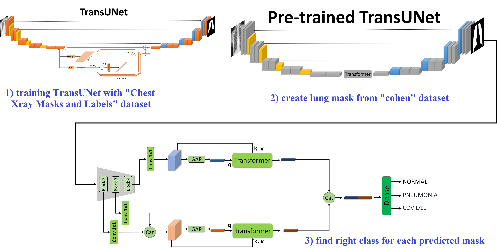

# Efficient and Accurate Pneumonia Detection Using a Novel Multi-Scale Transformer Approach
This is the implementation of the paper "Efficient and Accurate Pneumonia Detection Using a Novel Multi-Scale Transformer Approach" 

<p align="middle">
    
</p>

## Requirements

- Python 3.8.18
- PyTorch 1.8.1
- cuda 11.5
- tensorboard 2.12.1
- numpy 1.22.3
- sklearn 1.3

# Datasets used

The datasets used for this project are:
- [Kermany (Chest X-Ray Images (Pneumonia)) dataset](https://www.kaggle.com/datasets/andrewmvd/pediatric-pneumonia-chest-xray)
- [Cohen (COVID-19 image data collection) dataset](https://github.com/ieee8023/covid-chestxray-dataset)
- [Chest Xray Masks and Labels dataset](https://www.kaggle.com/datasets/nikhilpandey360/chest-xray-masks-and-labels)
## Prepare Dataset

Verify the dataset structure
Make sure your dataset is organized as follows:
                            
    ../                      
    ├── common/             
    ├── data/               
    |   ├── dataloader.py
    |   ├── Kermany/
    │   |   ├── train/
    │   |   │   ├── NORMAL
    │   |   |   └── PNEUMONIA
    │   |   └── test/
    │   |       ├── NORMAL
    │   |       └── PNEUMONIA
    |   ├── Cohen/
    │   │   ├── train/
    │   │   │   ├── COVID19
    │   │   │   ├── NORMAL
    │   │   |   └── PNEUMONIA
    │   │   └── test/
    │   │       ├── COVID19
    │   │       ├── NORMAL
    │   │       └── PNEUMONIA
    │   └── Chest_Xray_Masks_and_Labels/
    │       ├── train/
    │       │   ├── images
    │       |   └── masks
    │       └── test/
    │           ├── images
    │           └── masks
    ├── model/
    |   ├── MSR.py
    |   ├── backbone_utils.py
    |   └── transformer.py
    ├── README.md           
    ├── train_Cohen.py
    ├── train_Kermany.py
    ├── train_seg.py
    ├── test_Cohen.py
    ├── test_Kermany.py
    └── test_seg.py             
    


If your dataset structure is different, adjust the --data_dir argument accordingly.
# Segmentation Task

## Training
To train the model, use the following command:

> ```bash
> python train_seg.py --bsz 8
>                     --lr 1e-3
>                     --niter 30
>                     --data_dir data/Chest_Xray_Masks_and_Labels
>                     --logpath "your_experiment_name"
> ```

## Testing
To test the model, use the following command:

> ```bash
> python test_seg.py  --bsz 8
>                 --data_dir data/Chest_Xray_Masks_and_Labels
>                 --logpath "your_experiment_name"
> ```

# Classification Task (Kermany)

## Training
To train the model, use the following command:

> ```bash
> python train_kermany.py --bsz 64
>                         --lr 5e-5
>                         --niter 100
>                         --layers {50,101}
>                         --data_dir data/Kermany
>                         --logpath "your_experiment_name"
> ```

## Testing
To test the model, use the following command:

> ```bash
> python test_kermany.py  --bsz 64
>                         --layers {50,101}
>                         --data_dir data/Kermany
>                         --logpath "your_experiment_name"
> ```

# Classification Task (Cohen)

## Training
To train the model, use the following command:

> ```bash
> python train_cohen.py --bsz 64
>                       --lr 5e-5
>                       --niter 100
>                       --layers {50,101}
>                       --data_dir data/Kermany
>                       --logpath "your_experiment_name"
> ```

## Testing
To test the model, use the following command:

> ```bash
> python test_cohen.py  --bsz 64
>                       --layers {50,101}
>                       --data_dir data/Kermany
>                       --logpath "your_experiment_name"
> ```

## Arguments

- `--bsz`: Batch size for training.
- `--lr`: Learning rate for the optimizer.
- `--niter`: Number of training iterations (epochs). 
- `--layers`: Number of layers in the ResNet backbone (e.g., 50 or 101). 
- `--data_dir`: Directory where the dataset is located. 
- `--logpath`: Directory to save the best model checkpoint. 

